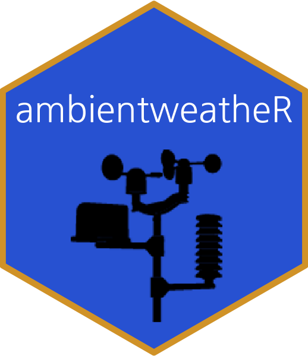
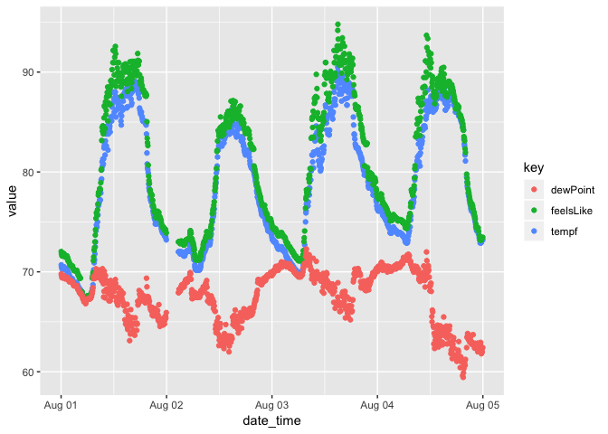

<!-- README.md is generated from README.Rmd. Please edit that file -->
ambientweatheR 
--------------------------------------------------------------------------------

`ambientweatheR` provides programmatic access to an Ambient Weather user's weather station data via REST API.

Ambient Weather API documentation available [HERE](https://ambientweather.docs.apiary.io/#).

Main functions:

-   `list_user_devices`: Lists user's available devices and each device's most recent data
-   `fetch_device_data`: Fetches data from a device for a given date, or for the last 24 hours

Installation
------------

``` r
devtools::install_github("andrewflack/ambientweatheR")
```

Example
-------

``` r
library(ambientweatheR)
library(tidyverse)
```

``` r
mac_address <- list_user_devices() %>% flatten() %>% pluck("macAddress")
```

``` r
df <- seq.Date(as.Date("2019-08-01"), as.Date("2019-08-04"), "day") %>% 
  map(as.character) %>% 
  map_df(~ fetch_device_data(mac_address, .x)$content)
```

``` r
df %>% 
  select(date_time, tempf, feelsLike, dewPoint) %>% 
  gather(key = "key", value = "value", -date_time) %>% 
  ggplot(aes(x = date_time, y = value, colour = key)) + 
  geom_point()
```


